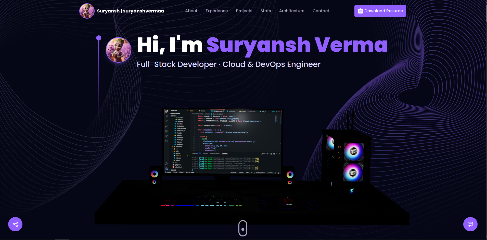

# 🚀 Suryansh Verma — 3D Portfolio (Next.js)

Welcome to the source code of **Suryansh Verma’s interactive developer portfolio** — a sleek and immersive experience crafted with **Next.js (App Router)**, **TypeScript**, **Tailwind CSS**, **Framer Motion**, and optional **3D visuals powered by Three.js / @react-three/fiber** 🎨✨  

This portfolio showcases professional experience, projects, and technical expertise with an emphasis on **clean design**, **smooth animations**, and **easy customization**.

---

## 🎯 **Key Objectives**

- 🚀 Present projects, experience, and technical skills clearly  
- 🛠️ Simplify customization with centralized constants  
- 🌌 Provide optional 3D visual polish while supporting a fast, 2D fallback  

---

## 🏠 **Home Page Overview**



*Figure: Overview of the homepage layout and major sections.*

---

## 🔗 **Quick Links**

- 💻 **Repo:** [github.com/suryanshvermaa/3DPortfolio](https://github.com/suryanshvermaa/3DPortfolio)  
- ⚙️ **Framework:** Next.js 14 (App Router)  
- 🧠 **Language:** TypeScript  

---

## ✨ **Features**

- ⚡ Modern **Next.js App Router** setup  
- 🎨 **Tailwind CSS** utility-first styling  
- 🌀 **Framer Motion** animations for smooth transitions  
- 🌍 **Optional 3D Scenes** — Computers, Earth, and Stars using Three.js  
- 📬 **Contact Form** powered by EmailJS  
- 🤖 **AI Assistant Chatbot** using a custom server-side API  
- 🧩 **Centralized content** in `app/constants` for effortless personalization  

---

## 🧰 **Requirements**

- 🟢 Node.js 18+ (or use **Bun** — repo includes `bun.lockb`)  
- 📦 npm or yarn  

---

## ⚙️ **Local Setup**

1. **Install dependencies**
   ```bash
   npm install
   ```

2. **Configure environment variables**  
   Copy `.env.example` (if available) and fill in required values.

   **Important environment variables:**
   - `UPSTASH_URL`, `UPSTASH_TOKEN` — optional (for Upstash Redis)
   - `MY_EMAIL`, `MY_PASSWORD` — SMTP credentials for Nodemailer
   - `GROQ_API_KEY` — for Groq SDK (chat model)
   - EmailJS public/private keys — used in `Contact.tsx`  

   ⚠️ Keep secrets out of source control.  
   For Vercel or similar, set these via project settings.

3. **Run the development server**
   ```bash
   npm run dev
   ```
   Visit 👉 [http://localhost:3000](http://localhost:3000)

4. **Build for production**
   ```bash
   npm run build
   npm start
   ```

5. **Lint the project**
   ```bash
   npm run lint
   ```

---

## 🏗️ **Project Structure**

```
app/
 ┣ layout.tsx           → Global layout & metadata
 ┣ page.tsx             → Top-level page rendering sections
 ┣ api/                 → API routes (chatbot, mail, config)
 ┣ bot/                 → Chat assistant logic
 ┣ components/          → React UI + 3D components
public/                 → Static assets (images, textures, icons)
tailwind.config.ts      → Tailwind CSS setup
next.config.mjs         → Next.js configuration
```

🪄 **Tip:** Edit `app/constants/index.ts` to personalize projects, experience, and technologies.

---

## 🧠 **Environment & Config Notes**

- Update `next.config.mjs` → `images.remotePatterns` for external image hosts (e.g., GitHub avatars).  
- `app/api/config.ts` includes **SMTP** and **Upstash Redis** clients — remove or stub if unused.  
- The chatbot logic in `app/bot/functions.ts` uses **Groq API** — update models or keys as needed.  

---

## 🧩 **Customization Tips**

- Update content inside `app/constants/index.ts` (projects, experiences, technologies).  
- To remove **3D effects** and make the site fully 2D:
  1. Remove `<ComputersCanvas />`, `<EarthCanvas />`, and `<StarsCanvas />` from components.
  2. Uninstall:
     ```bash
     npm uninstall three @react-three/fiber @react-three/drei maath
     ```
- Modify chatbot behavior via `/api/chatbot` in `app/api/chatbot/route.ts`.

---

## ☁️ **Deployment**

- **Vercel (Recommended)**  
  - Import repo → Configure environment variables in dashboard.  
  - Auto-detects Next.js + App Router.

- **Other Hosts:**  
  - Build with `npm run build`  
  - Serve `.next` folder  
  - Some providers require specific Next.js adapters.

---

## 🧩 **Troubleshooting**

- ❌ **Images not loading?**  
  Check that `next.config.mjs` allows the remote image hosts.  

- 📧 **SMTP issues?**  
  Verify credentials and consider secure alternatives (SendGrid, Mailgun).  

- 🤖 **Chatbot errors?**  
  Inspect server logs (`/api/chatbot`) and confirm API keys are valid.  

---

## 🤝 **Contributing**

Contributions and PRs are always welcome!  
For personal forks:
- Update constants in `app/constants`
- Replace assets in `public/`
- Deploy your personalized version 🚀

If submitting changes to the template, please include:
- A brief summary  
- Preview screenshots  

---

## 💖 **Acknowledgements**

Built with passion using:
**Next.js**, **Tailwind CSS**, **Framer Motion**, and **React Three Fiber** 🧠⚡  

---

### 🕓 **Last Updated:** November 10, 2025  
Made with ❤️ by **Suryansh Verma**